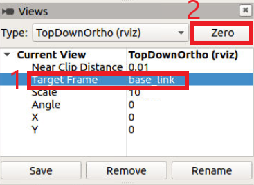
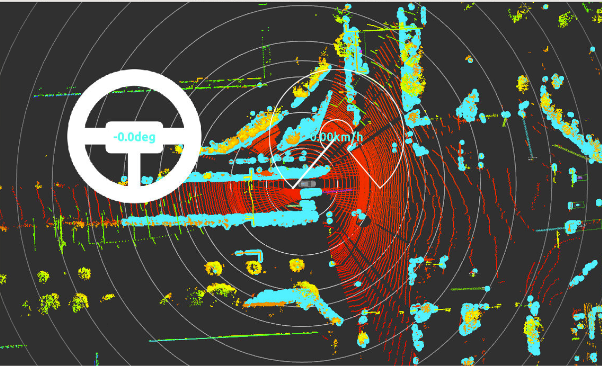
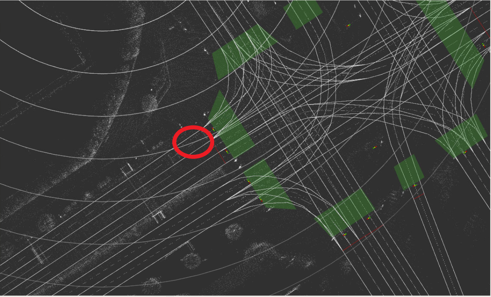

# Exercise 3: NDT Scan Matching

The purpose of this exercise is to show some features of Autoware's localization, which is achieved through a method called NDT Scan Matching. 

## Automatic self-pose estimation using GNSS
In the past, it was necessary to manually set the initial pose of the ego-vehicle, or to have recorded data containing a manually set initial pose. It is now possible for Autoware to estimate the initial pose of the ego-vehicle automatically using GNSS sensor data. This is a new feature that will be added to Autoware.Auto in the near future.

1. Open two terminal windows and run the following commands in *both* terminals
```
cd /home/autoware/autoware.proj
source ./install/setup.bash
``` 
2. In the first terminal, launch RViz
```
roslaunch autoware_launch logging_simulator.launch vehicle_model:=lexus sensor_model:=aip_xx1 map_path:=/home/autoware/handson/ex3/maps
```
3. In the second terminal, play the rosbag file
```
rosbag play /home/autoware/handson/ex3/sample.bag --clock -r 0.5
```

4. In the still active second terminal, hit the spacebar after a second to pause rosbag playback, then change the Target Frame of the view to "base_link" in RViz.
- In the Views panel on the left side of the window, double-click the Target Frame value and select "base_link"
- Click the "Zero" button



5. Hit the spacebar in the second terminal to resume rosbag playback and return to RViz

Whilst still in the 2D TopDownOrth view, we can see the recorded LiDAR sensor data being displayed first, and then after a few seconds, the NDT Scan Matching algorithm is able to match up the LiDAR sensor data with the high-definition pointcloud map data loaded into memory by using recorded GNSS data to establish the initial pose of the ego-vehicle.


## Pose estimation without GNSS initial pose
If GNSS data is not available, then the initial pose of the ego-vehicle can be manually set using RViz (something that we will come back to in the next exercise). For now, let's see what happens if we try to replay a rosbag with GNSS sensor data removed.

6. Open two new terminal windows and run the following commands in *both* terminals
```
cd /home/autoware/autoware.proj
source ./install/setup.bash
``` 
7. In the first terminal, launch RViz
```
roslaunch autoware_launch logging_simulator.launch vehicle_model:=lexus sensor_model:=aip_xx1 map_path:=/home/autoware/handson/ex3/maps
```
8. In the second terminal, play the rosbag file
```
rosbag play /home/autoware/handson/ex3/sample_no_gnss.bag --clock -r 0.5
```
9. In the still active second terminal, hit the spacebar after a second to pause rosbag playback, then change the Target Frame of the view to "base_link" in RViz again.

10. Hit the spacebar in the second terminal to resume rosbag playback and return to RViz

The view shows the ego-vehicle and the recorded LiDAR sensor data as before, but the HD map is not displayed because it's impossible for the NDT Scan Matching algorithm to match the LiDAR sensor data to the map's pointcloud data without an initial pose.




So now we're going to try again, but this time we will set an initial pose manually to see what happens.

11. Repeat steps 6-9, but this time wait around 5 seconds before hitting the spacebar to pause the rosbag's playback

12. Go back to RViz, scroll the map to the approximate position of where the ego-vehicle should be


13.  Set the initial pose of the ego-vehicle manually.
- Click “2D Pose estimate” button in the toolbar, or hit the “P” key


- Click and hold the left-mouse button, and then drag to set the direction of the pose

14.  Go back to the second terminal and hit spacebar to resume playback

Now, things should work in much the same way as they did at the start of the exercise, when GNSS sensor data was available. Given an initial pose, the NDT Scan Matching algorithm is now able to match the sensor data with the map's pointcloud data! 

| Next |
| ---- |
| [Exercise 4: Simulation testing with dummy objects](exercise4.md) |
